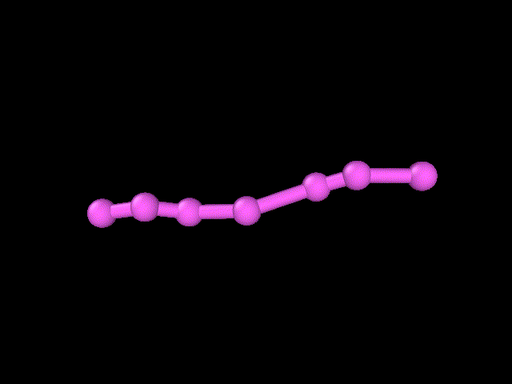
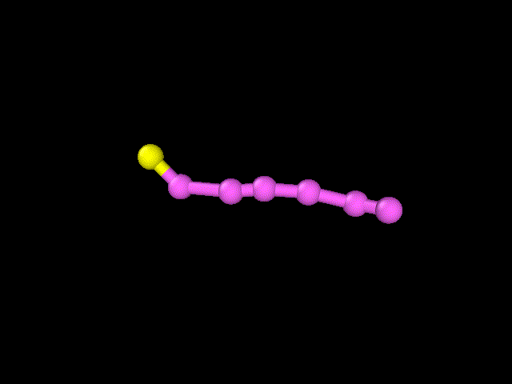
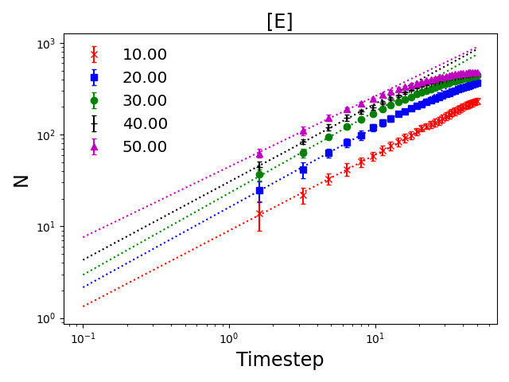
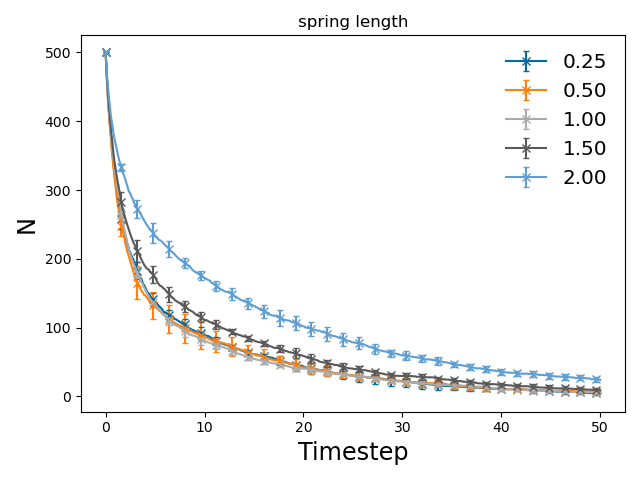
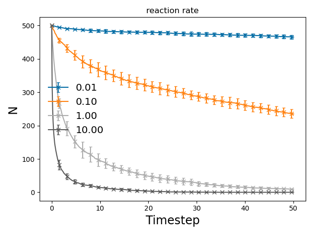
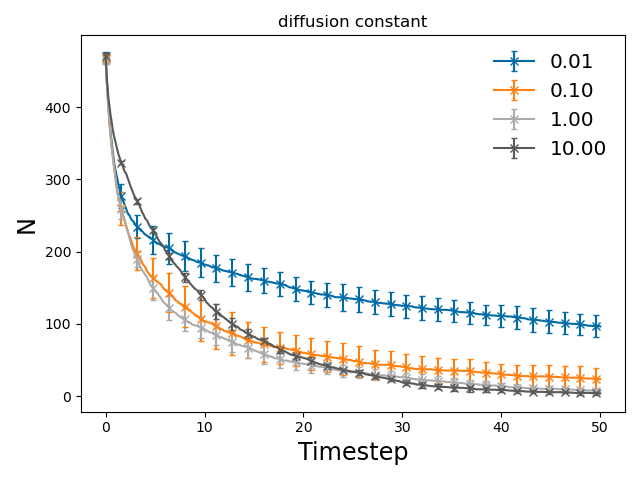

# Enzymatic Degradation Examples

## Introduction

### Monatomic Particle-Particle system

In monatomic reactions, we present the reaction scheme

$$
A + E \xrightarrow[r \leq r_e]\lambda B + E
$$

Where a particle $A$ reacts with an enzyme particle $E$ which converts it to particle $B$ with a reaction propensity (microscopic rate) $\lambda$. The reaction occurs using the Doi reaction model, meaning that a radius of encounter $r_e$ is used to describe the maximum distance that two particles must be separated by to react with one another, creating what is known as a reaction volume $V_{\text{eff}}$ that increases with $r_e$.

### Diatomic Molecule system

In a diatomic system, the previously described reaction still occurs, however particle $B$ is now considered an intermediate particle that allows bond breaking to occur. A new reaction is introduced, which is the effective bond disassociation reaction.

$$
A + B \xrightarrow{\infty} C + C
$$

For the purposes of our reaction schemes, we want this reaction to happen instantaneously, which results in the following higher level reaction scheme.

$$
A\text{-}A + E \xrightarrow[r \leq r_e]\lambda C + C + E
$$


### Polymer system

In polymer systems, the number of particles within a single molecule is not constant, as with diatomic molecules. This is because diatomic molecules have only one possible length (2) and two possible configurations, $A$-$A$ and $A$-$B$, only one of which has a structural reaction.

There are now three possible structural reactions that can occur.

$$
\begin{aligned}
\text{-}A\text{-}B\text{-}A\text{-} &\xrightarrow{\infty} \text{-}A\text{-}A + A\text{-}  \\
A\text{-}B &\xrightarrow{\infty} C + C \\
A\text{ or }B &\xrightarrow{\infty} C \\
\end{aligned}
$$

## Simulation Schemes

### Monatomic

To implement an enzymatic reaction in ReaDDy, a simple command can be used, the documentation for which can be found online:

```python
# A + E -> B + E
system.reactions.add(
    f'{reaction_name}: A + ({reaction_radius:.2f})E -> B + E',
    rate=reaction_rate
)
```

Where `reaction_radius` is $r_e$ and `reaction_rate` is $\lambda$.

### Diatomic

In the diatomic scheme, what is known as a structural reaction must be added. This occurs with a given rate, which in our case is set very high to ensure that the number of $B$ particles at any point in time is very low (in an ideal system this would 0, but in reality, we aim for numbers of $B$ particles to be less than 10). Structural reactions occur within a single topology (topology $\equiv$ molecule) and is not dependent on any particles that are stored outside of an individual topology.

Adding structural reactions is highly programmable in ReaDDy but result in slightly more complicated formations. A reaction function and rate function must be declared. For a constant rate, the rate function can be declared by using a `lambda` function, for example `lambda x: 10000` would result in a constant reaction rate of $10000$. Below the reaction function is presented.

```python
# reaction function
def diatomic_reaction_function(topology):
    # get reaction recipe
    recipe = readdy.StructuralReactionRecipe(topology)

    # get the vertices of the topology
    vertices = topology.get_graph().get_vertices()

    # sort types (either A or B) for easier analysis
    types = \
      [topology.particle_type_of_vertex(v) for v in vertices]

    # if B is present then change both particles to C
    # and delete bond by using recipe.separate_vertex
    if 'B' in types:
        recipe.separate_vertex(0)
        recipe.change_particle_type(vertices[0], 'C')
        recipe.change_particle_type(vertices[1], 'C')

    # return the configured recipe
    return recipe
```

```python
# A-B -> C + C
system.topologies.add_structural_reaction(
    name="BondBreaking",
    topology_type="molecule",
    reaction_function=reaction_function,
    rate_function=lambda x: 10000.0,
)
```
The previously described spatial reaction is registered identically since this determines when a bond should be broken.

### Polymer

In a polymer system the different cases discussed in the previous section creates added complexity to the structural reaction function. Although in our case we still contain these nuances within a single function, rather than adding more structural reactions functions that must be evaluated.

```python
def polymer_reaction_function(topology):
    recipe = readdy.StructuralReactionRecipe(topology)
    # it is possible for there to be a lone particle in a topology
    # when reactions happen very quickly, this step ensures that
    # these are converted to C particles which are not topology-bound
    vertices = topology.get_graph().get_vertices()
    if len(vertices) == 1:
        recipe.separate_vertex(0)
        recipe.change_particle_type(vertices[0], 'C')

    # register A-B -> C + C reaction
    elif len(vertices) == 2:
        types = [topology.particle_type_of_vertex(v) for v in vertices]
        types = sorted(types)
        if types[0] == 'A' and types[1] == 'B':
            recipe.separate_vertex(0)
            recipe.change_particle_type(vertices[0], 'C')
            recipe.change_particle_type(vertices[1], 'C')

    # register -A-B-A- -> -A + A-A-
    else:
        # insert reaction
        edges = topology.get_graph().get_edges()
        for edge in edges:
            if topology.particle_type_of_vertex(edge[0]) == 'B':
                recipe.remove_edge(edge[0], edge[1])
                recipe.change_particle_type(edge[0], 'A')
            elif topology.particle_type_of_vertex(edge[1]) == 'B':
                recipe.remove_edge(edge[0], edge[1])
                recipe.change_particle_type(edge[1], 'A')
    return recipe
```





## Results

### Monatomic






### Diatomic

### Polymer