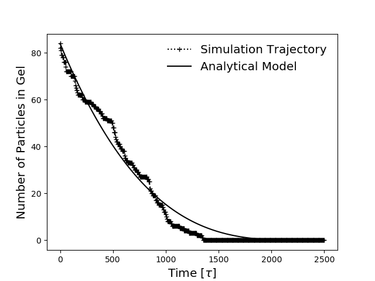

# Lennard Jones Gel Degradation - Simulation and Analytical Modelling

## Summary

In this protocol, we provide interactive scripts with a highly customisable command-line interface (CLI) tool to run iPRD simulations of microgel nanoparticles composed of Lennard-Jones particles. Additionally, using information from the trajectory, an analytical solution using the Debye-Smoluchowski model for the same system is generated and can be visualised alongside the simulation results

## Pre-requisites

If you are able to install the `hydrogels` software package (at the time of writing, this is only possible via building from GitHub) then this should be sufficient. To do this use these instructions (it is assumed that the user has the required packages installed.)

```
git clone https://github.com/debeshmandal/hydrogels
cd hydrogels
pip install .
pytest
```

## Usage

Within this folder is a file called `run.sh` that provides an example of how to use the script as well as demonstrating the results it generates.

The steps are as follows:

```
python main.py [-h] 
    [--box BOX] 
    [--number NUMBER] 
    [--radius RADIUS]
    [--bond-strength BOND_STRENGTH] 
    [--bond-length BOND_LENGTH]
    [--lj-eps LJ_EPS] 
    [--lj-sig LJ_SIG] 
    [--lj-cutoff LJ_CUTOFF]
    [--diffusion-constant DIFFUSION_CONSTANT]
    [--enzyme-number ENZYME_NUMBER] ]
    [--enzyme-radius ENZYME_RADIUS]
    [--reaction-rate REACTION_RATE]
    [--reaction-radius REACTION_RADIUS]
    [--sphere-radius SPHERE_RADIUS]
    [--sphere-force_constant SPHERE_FORCE_CONSTANT]
    [--stride STRIDE] 
    [--timestep TIMESTEP] 
    [--length LENGTH]
    [--json JSON]
    [--enforce]

python trajectory.py [-h] 
    [--data-file DATA_FILE]
    [--show] 
    [--plot-file PLOT_FILE]
    [--traj-folder TRAJ_FOLDER]
    [--particles-file PARTICLES_FILE] 
    [--json JSON]
    [--enforce]

python model.py [-h] 
    [--plot-file PLOT_FILE]
    [--model-file MODEL_FILE] 
    [--show]
    [--enforce]
    [--json JSON]                
```

The CLI allows a user to create a JSON file that provides all of the required information to replicate the generation of data using this folder and the `hydrogels` package. Advanced users can manipulate the name of this file to create the settings required to generate a variety of reproducible results.

Many of the functions are importable from within this folder but there is intentionally no `__init__.py` file present so that advanced users can copy the Python scripts in this folder, and create scripts of their own in separate directories.

## Reproduce from JSON

To reproduce the results of any script provided in this folder, run the script in this way:

```
python <script> --json <JSON_filename> --enforce
```

If there are any issues then the script will print instructions to console on how to remedy them.

## Running the Example

If the `hydrogels` module has been successfully installed as above, then calling the `run.sh` shell script will run the simulation.
```
bash run.sh
```
This takes around the scale of half an hour on a reasonably fast machine but can be slower depending on the specifications of the CPU.

The final figure will show the trajectory of the number of bonded gel particles in the simulation and plot it against the analytical model produced by the trajectory of the numerical simulation, shown below.



Finally, all data is written to CSV files and a file containing all of the settings of the simulation, trajectory analysis, and analytical model is contained in a single JSON file.

## Conclusions

## Notes